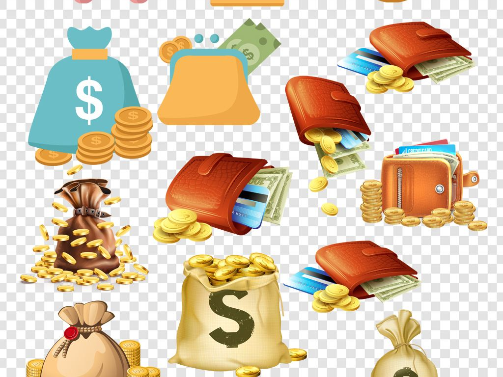
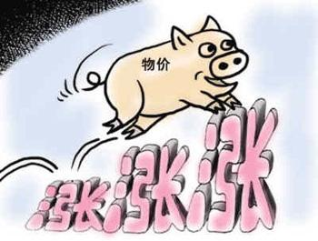

自己一直在北京，从事互联网技术相关的工作。最近，老家里的几个亲戚朋友，向我咨询：比特币是咋回事，什么是去中心化，为什么那么赚钱。

人啊就是这样，看着别人赚钱，自己就跃跃欲试。
<!--more-->

以比特币为代表的数字货币，被贴上各种牛逼的标签。本人不才，只想简单地谈谈，在我看来，这些牛逼的标签是不是真的牛逼。

在正式谈这些牛逼的标签之前，我先说一说：什么是财富？

### 财富与货币的关系

现实生活中，相当一部分人，把货币(钱)和财富等同为一个东东。但我这里可以向上帝保证：**货币（钱）不是财富**！

货币只是用来度量财富和交易财富的工具，我们可以简单的把货币看作是，人类挑选出来的作为财富的代表。

既然货币是财富的代表，那最好的状态就是一一对应，即一个单位的财富对应一个单位的货币。

当然这只是理论上，现实中不可能达到一比一的比例的。一方面人类在不停地创造财富和消耗财富；另一方面人类也需要根据社会经济情况，适当调整货币和财富的比例。比如，经济不好的时候，人类会通过适当将增加货币的比例，来促进经济发展，也就是适当的通货膨胀。经济过热时，人类可以适当降低货币的比例，从而抑制经济过热而出现泡沫，也就是所谓的适当通货紧缩。

财富和货币的关系，可以很形象的看作是：主人跟狗的关系。财富就是主人，货币就是狗。狗总是跟着主人走，时而走在主人前边，时而走在主人后边，但不能脱离太远。狗适当走在前边，就是适当通货膨胀，督促主人加快点步伐。如果狗走的前边太远，那就面临走丢的风险，对应成货币就是：货币要变的一文不值了。

从社会中的财富总量来说，财富总是随着人类的辛勤努力，慢慢的在增加，很难突然瞬间财富爆膨。所以，能够被用来作为财富代表的物品中，需满足这么几个特点：
1. 较为稀有，不能瞬间产生很多，也不能少的可怜
2. 比较容易保存和交换

这也就应了马克思说的：金银天然不是货币，但货币天然是金银。金银就是地球上的一种金属而已，并非生来就是货币。但由于它具有货币的这两个性质，而被人类规定为货币。

为什么人类历史上没有使用石头做货币呢？当然是因为石头太多了嘛。石头想要多少，几乎瞬间就能找到多少。跟财富的量，完全不成比例。如果脑洞一下，古代朝廷强制用石头做货币，会怎么样呢？那肯定是，我拉好几车的石头，来跟你交换一粒大米。

说清楚财富和货币的关系，接下来就可以说说，为众人所疯狂且津津乐道的，那几个数字货币的牛逼标签。

### 去中心化

数字货币，号称是一个去中心化的货币体系，没有中央银行，是安全和自由的保证。这是相较于现有的法定货币来说的一大特点。

现有的法定货币体系，是基于信用的货币体系，由各国的中央银行来控制管理。在更朝换代或者经济出现大危机时，确实会让人的财富存在安全问题；以及央行的监管，也会让贪污或者洗钱行为，变得不自由。但对于最广大的人民群众和现在这样的和平年代，其实并没有因为中心化，而那么的没安全感和缺乏自由。因为，政府虽然会有时出现偏差，但总的来说它还是要为整个国家和人民负责的。而且政府可以适当控制法定货币的比例，以起到“劫富济贫”的效果，这点是去中心化没法做到的。

在[《数字货币因何而值十万块》](/2018/01/15/szhbyhezsw/)中，我也说到了，数字货币跟黄金很像，这里不妨拿黄金来举例。

在我国古代，使用金银作为货币的时期，其本身也是一种去中心化的。只要金银在手，即便是更朝换代，也是安全和自由的，与朝廷没任何关系。

但财富总是遵循二八定律，总有一小部分人，持有大量的金银。在只接受金银进行纳税的朝廷，穷人只能卖掉粮食来纳税。所以当时也会有一帮掌握金银的财团，在秋收之际，囤积金银，哄抬金银价格，来掠取财富。朝廷也往往难以干预。

所以我想说：对我们最为广大的人民群众来说，中心化，有一个负责任的政府监管，反而才是自由和安全的。去中心化，反而并没有想的那么美好。

### 抗通胀

数字货币说自己扛通胀，比如比特币，总共就只有2100万枚，听起来似乎比黄金还稀缺。而相较于法定货币，央行确实想印多少有多少。

还是拿黄金类比。在布雷顿森林体系解体之后，黄金就永远的退出了人类货币的历史舞台，被窖藏在了底下金库。或许黄金现在还很值钱，但它不再是货币。

在上文也说了，货币的量总是围绕着财富的量按照一定的比例上下波。黄金退出货币的历史舞台，或许有一定原因是交易不如纸币方便，但主要是，黄金无法跟进入现代化社会后财富的创造量相适应。

以比特币为代表的数字货币也比较稀缺，所以我认为，它根本不可能成为货币。

比特币是不是真的稀缺呢，只能是在比特币这条区块链上稀缺。但是人类可以开发无数个类似于比特币这样的区块链，风险可见一斑。

数字货币主打的抗通胀，确实没问题。通胀确实可以洗劫人们积累的财富。但适当通胀，并没有那么可怕，有时经济的发展就需要一定的通胀来促进。

以数字货币的稀缺性，反而更容易导致通缩。大家都觉着通胀可怕，其实通缩一定也不比通胀差。

通缩，也就是货币升值，大家更容易囤积货币，抑制消费，反而更不利于经济发展。

通缩其实也是一种掠夺财富的方式。通缩时，只要持有货币，就可坐等分享别人努力创造的财富。举个简单地例子，把北京的房子看作是货币，你只要持有北京的房子，每天喝喝茶听听戏，就能轻松身价成百上千万。哪些每天朝九晚九，辛勤为社会创造财富的人，其实在为你打工。

再形象点说：假如你有一个苹果和一块钱，我也有一个苹果和一块钱，我可以用一块钱买你的苹果，同样你也可以买我的苹果。这里钱就是货币，苹果就是财富。假如你通过努力，自己又创造了俩苹果。这时你我总共有四个苹果和两块钱，于是通货紧缩，货币升值为，一块钱可以买俩苹果。

在这个过程中，可以看得出来，我啥也没干，手里就由两个苹果(一个苹果+一块钱买到的一个苹果)变成了三个苹果(一个苹果+一块钱买到的两个苹果)。

### 总结
其实，去中心化，也并不是那么完美无缺，如果没有靠谱的监管，其实更容易沦落为富人洗劫穷人财富的工具。

通胀确实可怕，它会稀释你积攒的财富；但是，通缩同样不可忽视，它会掠夺你正在努力创造的财富。